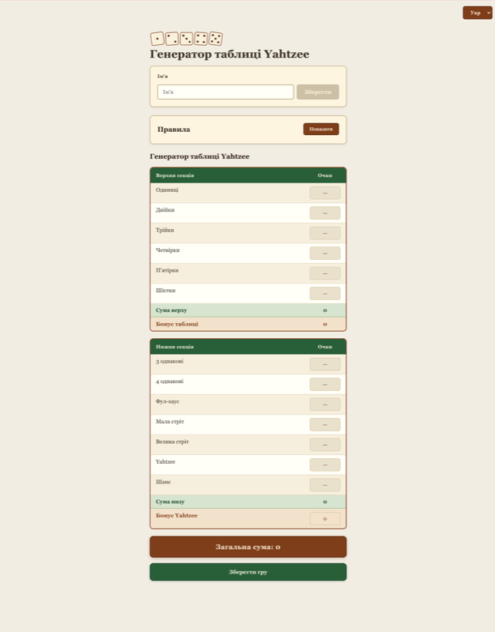
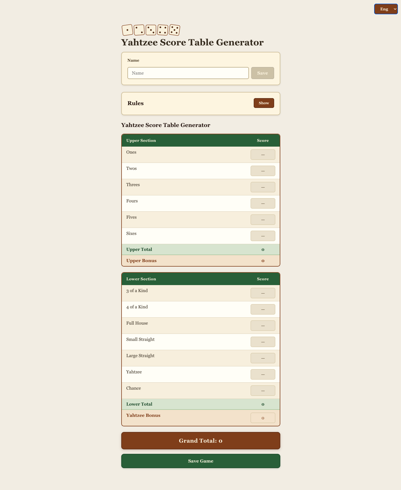

# Yahtzee Scorer

A board-game-styled Yahtzee scoring table built with Next.js, TypeScript, and React. Supports Ukrainian and English with a warm, classic design.

## Screenshots

| Ukrainian | English |
|-----------|-----------|
|  |  |

## Features

- **Bilingual Support**: Ukrainian (default) and English
- **Board Game Design**: Warm parchment, wood, and felt-green color palette
- **Single Scorecard**: One score per category — fill each category once per game
- **Fixed-Point Dropdowns**: Inline listbox for Full House (25), Small Straight (30), Large Straight (40), and Yahtzee (50) with a 0 option
- **Yahtzee Bonus**: Editable dropdown (0–1000 in steps of 100)
- **Automatic Calculations**: Upper section bonus (+35 if total ≥ 63) and grand total
- **Rules Reference**: Collapsible section with full gameplay summary, scoring table, Joker Rule, and special rules
- **Player Name**: Save and edit player name
- **Save Game**: Download the current scorecard as a self-contained HTML file (with all styles inlined) — works offline
- **Mobile Responsive**: Optimized for phones in portrait and landscape

## Yahtzee Rules

### Gameplay
- Each player rolls five dice, up to three times per turn
- Set aside dice to keep and re-roll the others
- Fill one scorecard category per turn — once filled, it cannot be reused

### Upper Section
| Category | Points |
|----------|--------|
| Ones through Sixes | Sum of matching dice |
| **Bonus** | +35 if upper total ≥ 63 |

### Lower Section
| Category | Points |
|----------|--------|
| Three of a Kind | Sum of all dice |
| Four of a Kind | Sum of all dice |
| Full House | 25 |
| Small Straight | 30 |
| Large Straight | 40 |
| Yahtzee | 50 |
| Chance | Sum of all dice |
| **Yahtzee Bonus** | +100 per additional Yahtzee |

### Special Rules
- **Joker Rule**: If Yahtzee is already filled and the matching upper category is also filled, the roll can be used as a joker in any lower section category.

## Tech Stack

- **Next.js 14** — App Router, single-page client app
- **React 18** — UI with `useState` hooks only
- **TypeScript 5** — Strict mode
- **CSS Grid** — Global stylesheet, no external CSS libraries
- **pnpm** — Package manager
- **Vercel** — Deployment via GitHub Actions

## Getting Started

### Prerequisites

- Node.js 20+
- pnpm

### Installation

```bash
git clone <repository-url>
cd yahtzee
pnpm install
pnpm run dev
```

Open [http://localhost:3000](http://localhost:3000).

### Production Build

```bash
pnpm build
pnpm start
```

## License

GPL v3
